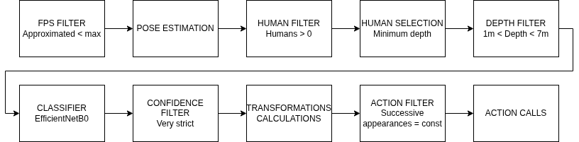

### Gesture Recognition Module (T4.3)

**Harokopio University of Athens**

**Contact info: kfoteinos@hua.gr**

TODO

### General information

This module takes as input aligned RGBD frames and the (global) pose of the camera (i.e. orientation and 2D position) at that timestamp (approximately) and performs gesture classication and pose estimation simultaneously; if a gesture is detected with high confidence and sufficiently close to the camera, it publishes, for a particular human considered to be the signer (e.g. the closest one), the pixel coordinates (uv) of her/his keypoints (e.g. ankles, shoulders), their depth and estimation confidence. Further, it estimates the uv position and depth of his/her by getting the average of the uv and depth correspond to the two shoulders. This information is utilized to predict the (global) longitude and latitude coordinates. Robot actions are triggered.

Transitions between coordinate systems:
- uvd: uv (image plane) & depth
- rel_xyz: (optical) camera frame xyz (backprojection) (camera_depth_frame)
- base_xyz: base link
- gps: GPS or global or absolute (longitude, latitude)
- abs_xy: Absolute xy (i.e. the "tangent" plane, oriented by the meridians and parallels)



> Use the `JETSON-Dockerfile` for deployment on Jetson

<!-- `docker exec -it <container ID> bash -c "source /opt/ros/humble/setup.bash;source ./install/local_setup.bash;ros2 run gesture_recognition producer"` -->

### Provided interface

| Topic name | Message type | Usage | Details |
| --- | --- | --- | --- |
| /camera_front_435i/realsense_front_435i/color/image_raw | Image | Input | 8-bit RGB (H x W x 3) |
| /camera_front_435i/realsense_front_435i/depth/image_rect_raw | Image | Input | 16UC1 in mm (H x W x 2) aligned to the RGB |
| /camera_front_435i/realsense_front_435i/color/camera_info | CameraInfo | Input | - |
| /fix | NavSatFix | Input | - |
| /gesture_command | String | Output | Stringified GeoJSON, see below |
<!-- | /dog_odom | Odometry | Input | Orientation should be expresses wr.t. to a global coordinate system (the "standard" xy plane aligned to parallels and meridians) | -->

Parameters (`classifier.py`):

-   `NO_UNDERLYING_IMPL`: Make it `False` during integration with the UPC, `True` otherwise (e.g. testing without the UGV interface implementation).
-   `MAX_FPS`: Maximum FPS. Ignores frames if the current FPS approximation is more than this threshold.
-   Topics names should also change.

The exact message format has as follows:

```json
{
    "type": "FeatureCollection",
    "features":[
        {
            "type": "Feature",
            "geometry": {
                "type": "Point",
                "coordinates":      [<longitude>, <latitude>]
            },
            "properties": {
               "class":             <predicted class>,
               "confidence":        <confidence of the prediction (0-1)>,
               "depth":             <distance between the signer and the camera (mm)>,
               "id":                <serial number>,
               "timestamp":         <time in nanoseconds>,
               "keypoints_and_depths": {
                  "Nose":           [<u (pixels)>, <v (pixels)>, <confidence (0-1)>, <depth (mm)>],
                  "Left Eye":       [<u (pixels)>, <v (pixels)>, <confidence (0-1)>, <depth (mm)>],
                  "Right Eye":      [<u (pixels)>, <v (pixels)>, <confidence (0-1)>, <depth (mm)>],
                  "Left Ear":       [<u (pixels)>, <v (pixels)>, <confidence (0-1)>, <depth (mm)>],
                  "Right Ear":      [<u (pixels)>, <v (pixels)>, <confidence (0-1)>, <depth (mm)>],
                  "Left Shoulder":  [<u (pixels)>, <v (pixels)>, <confidence (0-1)>, <depth (mm)>],
                  "Right Shoulder": [<u (pixels)>, <v (pixels)>, <confidence (0-1)>, <depth (mm)>],
                  "Left Elbow":     [<u (pixels)>, <v (pixels)>, <confidence (0-1)>, <depth (mm)>],
                  "Right Elbow":    [<u (pixels)>, <v (pixels)>, <confidence (0-1)>, <depth (mm)>],
                  "Left Wrist":     [<u (pixels)>, <v (pixels)>, <confidence (0-1)>, <depth (mm)>],
                  "Right Wrist":    [<u (pixels)>, <v (pixels)>, <confidence (0-1)>, <depth (mm)>],
                  "Left Hip":       [<u (pixels)>, <v (pixels)>, <confidence (0-1)>, <depth (mm)>],
                  "Right Hip":      [<u (pixels)>, <v (pixels)>, <confidence (0-1)>, <depth (mm)>],
                  "Left Knee":      [<u (pixels)>, <v (pixels)>, <confidence (0-1)>, <depth (mm)>],
                  "Right Knee":     [<u (pixels)>, <v (pixels)>, <confidence (0-1)>, <depth (mm)>],
                  "Left Ankle":     [<u (pixels)>, <v (pixels)>, <confidence (0-1)>, <depth (mm)>],
                  "Right Ankle":    [<u (pixels)>, <v (pixels)>, <confidence (0-1)>, <depth (mm)>]
               },
               "camera_frame_position": {
                  "rel_x": <relative x in camera frame (mm)>,
                  "rel_y": <relative y in camera frame (mm)>,
                  "rel_z": <relative z in camera frame (mm)>
                }
            }
        }
    ]
}
```

> Zero depth means u or v exceeds the limits of the depth frame, i.e. the keypoint falls out the image

See also the example below, produced by the command `ros2 topic echo /gesture_command --once --full`:

```json
{
    "type": "FeatureCollection",
    "features": [
        {
            "type": "Feature",
            "geometry": {
                "type": "Point",
                "coordinates": [
                    0.004612564554876909,
                    2.3243907976592615e-05
                ]
            },
            "properties": {
                "class": "emergency-situation",
                "confidence": 0.9997270703315735,
                "depth": 2587.5,
                "id": 45,
                "timestamp": 1775664019911363811,
                "keypoints_and_depths": {
                    "Nose": [
                        356,
                        236,
                        0.9185348749160767,
                        24401.0
                    ],
                    "Left Eye": [
                        362,
                        230,
                        0.8884150981903076,
                        0.0
                    ],
                    "Right Eye": [
                        351,
                        230,
                        0.9121984839439392,
                        0.0
                    ],
                    "Left Ear": [
                        371,
                        230,
                        0.6128950119018555,
                        0.0
                    ],
                    "Right Ear": [
                        341,
                        231,
                        0.6550174355506897,
                        0.0
                    ],
                    "Left Shoulder": [
                        384,
                        269,
                        0.9954492449760437,
                        2591.0
                    ],
                    "Right Shoulder": [
                        329,
                        270,
                        0.9929210543632507,
                        2584.0
                    ],
                    "Left Elbow": [
                        396,
                        277,
                        0.9914302229881287,
                        2528.0
                    ],
                    "Right Elbow": [
                        313,
                        282,
                        0.9697051644325256,
                        2572.0
                    ],
                    "Left Wrist": [
                        350,
                        231,
                        0.9784712195396423,
                        0.0
                    ],
                    "Right Wrist": [
                        337,
                        247,
                        0.9641135334968567,
                        38861.0
                    ],
                    "Left Hip": [
                        374,
                        394,
                        0.9941009879112244,
                        2650.0
                    ],
                    "Right Hip": [
                        334,
                        392,
                        0.992789089679718,
                        2636.0
                    ],
                    "Left Knee": [
                        375,
                        478,
                        0.33960723876953125,
                        0.0
                    ],
                    "Right Knee": [
                        329,
                        468,
                        0.2510174810886383,
                        2765.0
                    ],
                    "Left Ankle": [
                        375,
                        477,
                        0.007985803298652172,
                        0.0
                    ],
                    "Right Ankle": [
                        328,
                        473,
                        0.0036594585981220007,
                        0.0
                    ]
                },
                "camera_frame_position": {
                    "rel_x": -1467.1125000000002,
                    "rel_y": -468.33749999999986,
                    "rel_z": 2587.5
                }
            }
        }
    ]
}

```

**Important:** No messages are produced if the pose estimator fails and/or the gesture prediction confidence is less than a threshold.

### Native installation (scripts)

```bash
chmod +x compile_and_run.sh setup_venv.sh run_producer.sh
./setup_venv.sh
./compile_and_run.sh
```

### Native installation (manually)

Create a python virtual environment:

```bash
python3 -m venv gesture_commander_venv
```

Download Jetson Jetpack 6 torch & torchvision wheels:

```bash
wget https://nvidia.box.com/shared/static/zvultzsmd4iuheykxy17s4l2n91ylpl8.whl -O torch-2.3.0-cp310-cp310-linux_aarch64.whl
wget https://nvidia.box.com/shared/static/u0ziu01c0kyji4zz3gxam79181nebylf.whl -O torchvision-0.18.0a0+6043bc2-cp310-cp310-linux_aarch64.whl
```

Modify the `executable` property in `gesture_recognition/setup.cfg`:
```ini
[build_scripts]
executable=<path to venv>/gesture_commander_venv/bin/python3
[develop]
script_dir=$base/lib/gesture_recognition
[install]
install_scripts=$base/lib/gesture_recognition
```

Optionally, to generate dummy data for testing; modify the `PATH` global variable in `gesture_recognition/gesture_recognition/producer.py`:
```python
EARTH_RADIUS = 6378137.0 # in meters
PATH = <path to gesture module>
FPS = 1.0
```

Activate it:
```bash
source ./gesture_commander_venv/bin/activate
```

Install wheels:
```bash
pip install torch-2.3.0-cp310-cp310-linux_aarch64.whl
pip install torchvision-0.18.0a0+6043bc2-cp310-cp310-linux_aarch64.whl
```

Install dependencies:
```bash
pip3 install numpy==1.26.4 opencv-python==4.10.0.84 ultralytics
```

Clean build trash:
```bash
rm -rf build install log
```

Setup UPC interface:
```bash
source /home/triffid/upc_ws/install/setup.bash
```

Rebuild the package:
```bash
colcon build --packages-select gesture_recognition
```

Install the package:
```bash
source ./install/local_setup.bash
```

Run the classification node:
```bash
ros2 run gesture_recognition gesture_classifier
```

Run the stub producer:
```bash
ros2 run gesture_recognition producer
```

View the detections topic:
```bash
ros2 topic echo gesture_command --once --full
```

------------------------------------------------------------
------------------------------------------------------------

### Instructions for setup (Docker)

Sudo may be required.

To build the image:
```bash
docker build -t gesture_container .
```

> To view the existing images:
> ```bash
> docker images -a
> ```
>
> To remove an image:
> ```bash
> docker rmi gesture_container
> ```

To create & enter the container (the `--net host` is mandatory to enable access to outside topics and `--gpus all` for accessing the available GPUs):
```bash
docker run --net host --gpus all -it gesture_container /bin/bash
```

> Use `--runtime=nvidia` instead of `--gpus all` in the Jetson

To view the running containers:
```bash
docker container ps -a
```

> To remove all containers:
> ```bash
> docker container prune
> ```

To enter the container:
```bash
docker exec -it <container ID> bash
```

<!-- ### Instructions for playing the ROS2 bag:

Extract everything from the .zip file and run:
```bash
ros2 bag play <db3 file>
```
-->

### Instructions for setup (using the scripts)

```bash
chmod +x run_classifier.sh
chmod +x run_producer.sh
./run_classifier.sh
```

Only for the simulated data: open a second terminal, enter the container and type `./run_producer.sh`.

### Instructions for setup (using ROS directly)

After entering the container:

Activate ROS (Humble) (zsh, bash, ... according to your terminal):
```bash
source /opt/ros/humble/setup.bash
```

Clone, build and install the UPC interface: https://gitlab.com/asantamarianavarro/code/projects/triffid/robal_interfaces.

> Use `docker cp` to copy the folder within the container

Build the package:
```bash
colcon build --packages-select gesture_recognition
```

Run the following before use the package:
```bash
source ./install/local_setup.bash
```

Run the classification node:

```bash
ros2 run gesture_recognition gesture_classifier
```

Run the stub producer:

```bash
ros2 run gesture_recognition producer
```

View the detections topic:
```bash
ros2 topic echo gesture_command --once --full
```